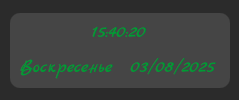

# ClockDateWidget

[Главная](../README.md) | [Плагины](index.md)

## Заметка

* Доступно на всех доступных плалатформах

## Описание

Стандартный окно, показывающие время, дату и день недели

## Настройка config.toml

### Раздел clockFormat

1. dateFormat - формат вывода даты
2. timeFormat - формат вывода времени

> Для вывода даты и времени используется Qt.formatDateTime (Элемент QML)  
> Для настройки форматов для себя обратитель к документации [Qt.formatDateTime](https://doc.qt.io/qt-6/qml-qtqml-qt.html#formatDateTime-method)
