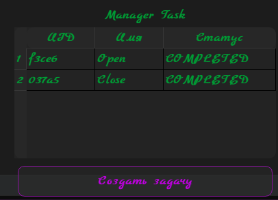

# MangerTask

[Главная](../README.md) | [Плагины](index.md)

## Заметка

* Доступно на всех доступных плалатформах  
* Находится в разработке

## Описание

Плагин для запуска задач по таймеру или времени  
Был создан по подобию `Планровщик задач` в OS Windows

## Настройка config.toml

### Раздел tasks

Поле path содержить имя файла куда будут сохранятся задачи (По дефолту будет `tasks.yml`)
> Формат файла содержит язык разметки yaml

## Место сохранения

* Задачи будут находится по пути:
`/путь/к/оверлею/plugins/plugin_data/ManagerTast/имя_файла.yml`

* Остальные состояния сохнаются:
`/путь/к/оверлею/configs/config.ini`
