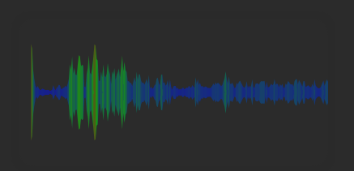

# VirtualizationWidget

[Главная](../README.md) | [Плагины](index.md)

## Заметка

* Доступно на всех доступных плалатформах  
* Находится в разработке

## Описание

Плагин для виртуализации звука с входных каналов

> В настройках плагина можно настроить входной поток
