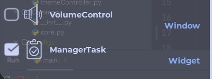

# Разработка

[Главная](../README.md)

## Сборка под свою ОСь

Для разработки или нужно скачать сам репозиторий  
Дальше установить менеджер проекта uv:

- pip install uv
- Либо смотрите в [официальную документацию](https://docs.astral.sh/uv/)

Потом в корне проекта в терминале вызываете

```bash
uv sync
```

После установки всего можно разрабатывать
> Мой совет после установки рекомендуется для не кроссплатформенных пакетов лучше указывать для какой они системе 

## Сборка

Вы можете конечно сами выбирать как и что собирать
Но настоятельно рекомендую использовать:

- на Unix подобных

    ```bash
    source ./build.cmd
    ```

- на Windows(NT)

    ```shell
    .\build.cmd
    ```

В нем уже все настроено и готовое приложение будет находится в корневой папке с именем Overlay
> Расширение зависит от системы  
> В Alt gnome linux у меня его нет  
> В Windows будет exe

## Описание

Для создания плагинов будет нужен OverlayTools, чтобы папку с нужной структурой для упаковки в сам плагин, а потом в пакет

Код создания плагина окна:

```bash
./OverlatTools create plugin <ИмяПлагина> <Корневая папка куда будет создоватся папка плагина> --window[-wn]
```

Код создания плагина виджета:

```bash
./OverlayTools create plugin <ИмяПлагина> <Корневая папка куда будет создоватся папка плагина> --widget[-wg]
```

Наличие обоих флагов не выдает также, как и остуствие их обоих. При налочие обоих флагов будут созданные конструкции обоих типов виджетов, но при импорте они будут отображатся 2 разных плагинах.
  
Отстутвие обоих флагов создасть просто пустую загрузучной файл для плагина который нужно будет самому прописовать

## Собственно разработка

Общие системы настроки [[APIBaseWidget](core.md)]

Разработка для окон [[OWindow](owindow.md)]  
Разработка для виджетов [[OWidget](owidget.md)]

### Дополнения

Включение подержки выполения через OverlayCLI[[CLInterface](cliterface.md)]

Индекс рекомендуемых API для использования[../autoapi/index.html]
